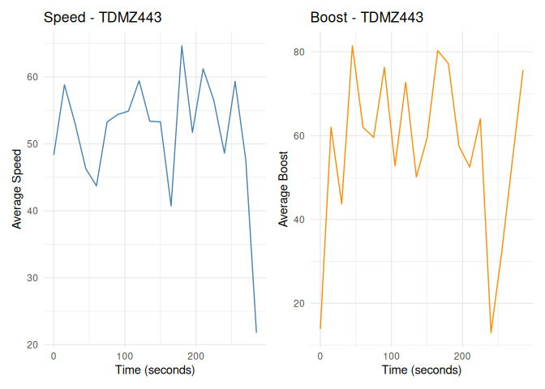

<!-- README.md is generated from README.Rmd. Please edit that file -->

# rlstats

<!-- badges: start -->

<!-- badges: end -->

The goal of the rlstats is to package is to provide some useful
functions for analyzing rocket league gameplay data. A player can use
this package to analyze the data from their own games. If you are
interested in doing this, first check out the [Rocket League Stats
API](https://www.rocketleague.com/developer/stats-api). You will need to
follow the instructions provided to begin recording your gameplay data.
You will also need some sort of script to read in this data, and write
it to a file for you to work with. Take a look at the dataset in this
package. All columns names of your personal dataset must match exactly
the column names in this dataset, which in turn matches exactly to the
field names in the original API. Once you get your own gameplay file,
you’re ready to roll!

## Installation

You can install the development version of rlstats from
[GitHub](https://github.com/) with:

``` r
#install.packages("remotes")
#install.packages("devtools")
devtools::install_github("ADC-405-S26/rlstats")
```

## Examples

This package contains three main functions. Two for analyzing a specific
player, and one for comparison between teams in a match. Below you’ll
see usage of all three.

``` r
library(rlstats)
```

#### stats_for_player

This function outputs a table with some basic summary statistics for a
specified player

``` r
stats_for_player(TDMZ443games, name = "TDMZ443")
```

<div id="fyuqdzaaon" style="padding-left:0px;padding-right:0px;padding-top:10px;padding-bottom:10px;overflow-x:auto;overflow-y:auto;width:auto;height:auto;">
<style>#fyuqdzaaon table {
  font-family: system-ui, 'Segoe UI', Roboto, Helvetica, Arial, sans-serif, 'Apple Color Emoji', 'Segoe UI Emoji', 'Segoe UI Symbol', 'Noto Color Emoji';
  -webkit-font-smoothing: antialiased;
  -moz-osx-font-smoothing: grayscale;
}
&#10;#fyuqdzaaon thead, #fyuqdzaaon tbody, #fyuqdzaaon tfoot, #fyuqdzaaon tr, #fyuqdzaaon td, #fyuqdzaaon th {
  border-style: none;
}
&#10;#fyuqdzaaon p {
  margin: 0;
  padding: 0;
}
&#10;#fyuqdzaaon .gt_table {
  display: table;
  border-collapse: collapse;
  line-height: normal;
  margin-left: auto;
  margin-right: auto;
  color: #333333;
  font-size: 16px;
  font-weight: normal;
  font-style: normal;
  background-color: #FFFFFF;
  width: auto;
  border-top-style: solid;
  border-top-width: 2px;
  border-top-color: #A8A8A8;
  border-right-style: none;
  border-right-width: 2px;
  border-right-color: #D3D3D3;
  border-bottom-style: solid;
  border-bottom-width: 2px;
  border-bottom-color: #A8A8A8;
  border-left-style: none;
  border-left-width: 2px;
  border-left-color: #D3D3D3;
}
&#10;#fyuqdzaaon .gt_caption {
  padding-top: 4px;
  padding-bottom: 4px;
}
&#10;#fyuqdzaaon .gt_title {
  color: #333333;
  font-size: 125%;
  font-weight: initial;
  padding-top: 4px;
  padding-bottom: 4px;
  padding-left: 5px;
  padding-right: 5px;
  border-bottom-color: #FFFFFF;
  border-bottom-width: 0;
}
&#10;#fyuqdzaaon .gt_subtitle {
  color: #333333;
  font-size: 85%;
  font-weight: initial;
  padding-top: 3px;
  padding-bottom: 5px;
  padding-left: 5px;
  padding-right: 5px;
  border-top-color: #FFFFFF;
  border-top-width: 0;
}
&#10;#fyuqdzaaon .gt_heading {
  background-color: #FFFFFF;
  text-align: center;
  border-bottom-color: #FFFFFF;
  border-left-style: none;
  border-left-width: 1px;
  border-left-color: #D3D3D3;
  border-right-style: none;
  border-right-width: 1px;
  border-right-color: #D3D3D3;
}
&#10;#fyuqdzaaon .gt_bottom_border {
  border-bottom-style: solid;
  border-bottom-width: 2px;
  border-bottom-color: #D3D3D3;
}
&#10;#fyuqdzaaon .gt_col_headings {
  border-top-style: solid;
  border-top-width: 2px;
  border-top-color: #D3D3D3;
  border-bottom-style: solid;
  border-bottom-width: 2px;
  border-bottom-color: #D3D3D3;
  border-left-style: none;
  border-left-width: 1px;
  border-left-color: #D3D3D3;
  border-right-style: none;
  border-right-width: 1px;
  border-right-color: #D3D3D3;
}
&#10;#fyuqdzaaon .gt_col_heading {
  color: #333333;
  background-color: #FFFFFF;
  font-size: 100%;
  font-weight: normal;
  text-transform: inherit;
  border-left-style: none;
  border-left-width: 1px;
  border-left-color: #D3D3D3;
  border-right-style: none;
  border-right-width: 1px;
  border-right-color: #D3D3D3;
  vertical-align: bottom;
  padding-top: 5px;
  padding-bottom: 6px;
  padding-left: 5px;
  padding-right: 5px;
  overflow-x: hidden;
}
&#10;#fyuqdzaaon .gt_column_spanner_outer {
  color: #333333;
  background-color: #FFFFFF;
  font-size: 100%;
  font-weight: normal;
  text-transform: inherit;
  padding-top: 0;
  padding-bottom: 0;
  padding-left: 4px;
  padding-right: 4px;
}
&#10;#fyuqdzaaon .gt_column_spanner_outer:first-child {
  padding-left: 0;
}
&#10;#fyuqdzaaon .gt_column_spanner_outer:last-child {
  padding-right: 0;
}
&#10;#fyuqdzaaon .gt_column_spanner {
  border-bottom-style: solid;
  border-bottom-width: 2px;
  border-bottom-color: #D3D3D3;
  vertical-align: bottom;
  padding-top: 5px;
  padding-bottom: 5px;
  overflow-x: hidden;
  display: inline-block;
  width: 100%;
}
&#10;#fyuqdzaaon .gt_spanner_row {
  border-bottom-style: hidden;
}
&#10;#fyuqdzaaon .gt_group_heading {
  padding-top: 8px;
  padding-bottom: 8px;
  padding-left: 5px;
  padding-right: 5px;
  color: #333333;
  background-color: #FFFFFF;
  font-size: 100%;
  font-weight: initial;
  text-transform: inherit;
  border-top-style: solid;
  border-top-width: 2px;
  border-top-color: #D3D3D3;
  border-bottom-style: solid;
  border-bottom-width: 2px;
  border-bottom-color: #D3D3D3;
  border-left-style: none;
  border-left-width: 1px;
  border-left-color: #D3D3D3;
  border-right-style: none;
  border-right-width: 1px;
  border-right-color: #D3D3D3;
  vertical-align: middle;
  text-align: left;
}
&#10;#fyuqdzaaon .gt_empty_group_heading {
  padding: 0.5px;
  color: #333333;
  background-color: #FFFFFF;
  font-size: 100%;
  font-weight: initial;
  border-top-style: solid;
  border-top-width: 2px;
  border-top-color: #D3D3D3;
  border-bottom-style: solid;
  border-bottom-width: 2px;
  border-bottom-color: #D3D3D3;
  vertical-align: middle;
}
&#10;#fyuqdzaaon .gt_from_md > :first-child {
  margin-top: 0;
}
&#10;#fyuqdzaaon .gt_from_md > :last-child {
  margin-bottom: 0;
}
&#10;#fyuqdzaaon .gt_row {
  padding-top: 8px;
  padding-bottom: 8px;
  padding-left: 5px;
  padding-right: 5px;
  margin: 10px;
  border-top-style: solid;
  border-top-width: 1px;
  border-top-color: #D3D3D3;
  border-left-style: none;
  border-left-width: 1px;
  border-left-color: #D3D3D3;
  border-right-style: none;
  border-right-width: 1px;
  border-right-color: #D3D3D3;
  vertical-align: middle;
  overflow-x: hidden;
}
&#10;#fyuqdzaaon .gt_stub {
  color: #333333;
  background-color: #FFFFFF;
  font-size: 100%;
  font-weight: initial;
  text-transform: inherit;
  border-right-style: solid;
  border-right-width: 2px;
  border-right-color: #D3D3D3;
  padding-left: 5px;
  padding-right: 5px;
}
&#10;#fyuqdzaaon .gt_stub_row_group {
  color: #333333;
  background-color: #FFFFFF;
  font-size: 100%;
  font-weight: initial;
  text-transform: inherit;
  border-right-style: solid;
  border-right-width: 2px;
  border-right-color: #D3D3D3;
  padding-left: 5px;
  padding-right: 5px;
  vertical-align: top;
}
&#10;#fyuqdzaaon .gt_row_group_first td {
  border-top-width: 2px;
}
&#10;#fyuqdzaaon .gt_row_group_first th {
  border-top-width: 2px;
}
&#10;#fyuqdzaaon .gt_summary_row {
  color: #333333;
  background-color: #FFFFFF;
  text-transform: inherit;
  padding-top: 8px;
  padding-bottom: 8px;
  padding-left: 5px;
  padding-right: 5px;
}
&#10;#fyuqdzaaon .gt_first_summary_row {
  border-top-style: solid;
  border-top-color: #D3D3D3;
}
&#10;#fyuqdzaaon .gt_first_summary_row.thick {
  border-top-width: 2px;
}
&#10;#fyuqdzaaon .gt_last_summary_row {
  padding-top: 8px;
  padding-bottom: 8px;
  padding-left: 5px;
  padding-right: 5px;
  border-bottom-style: solid;
  border-bottom-width: 2px;
  border-bottom-color: #D3D3D3;
}
&#10;#fyuqdzaaon .gt_grand_summary_row {
  color: #333333;
  background-color: #FFFFFF;
  text-transform: inherit;
  padding-top: 8px;
  padding-bottom: 8px;
  padding-left: 5px;
  padding-right: 5px;
}
&#10;#fyuqdzaaon .gt_first_grand_summary_row {
  padding-top: 8px;
  padding-bottom: 8px;
  padding-left: 5px;
  padding-right: 5px;
  border-top-style: double;
  border-top-width: 6px;
  border-top-color: #D3D3D3;
}
&#10;#fyuqdzaaon .gt_last_grand_summary_row_top {
  padding-top: 8px;
  padding-bottom: 8px;
  padding-left: 5px;
  padding-right: 5px;
  border-bottom-style: double;
  border-bottom-width: 6px;
  border-bottom-color: #D3D3D3;
}
&#10;#fyuqdzaaon .gt_striped {
  background-color: rgba(128, 128, 128, 0.05);
}
&#10;#fyuqdzaaon .gt_table_body {
  border-top-style: solid;
  border-top-width: 2px;
  border-top-color: #D3D3D3;
  border-bottom-style: solid;
  border-bottom-width: 2px;
  border-bottom-color: #D3D3D3;
}
&#10;#fyuqdzaaon .gt_footnotes {
  color: #333333;
  background-color: #FFFFFF;
  border-bottom-style: none;
  border-bottom-width: 2px;
  border-bottom-color: #D3D3D3;
  border-left-style: none;
  border-left-width: 2px;
  border-left-color: #D3D3D3;
  border-right-style: none;
  border-right-width: 2px;
  border-right-color: #D3D3D3;
}
&#10;#fyuqdzaaon .gt_footnote {
  margin: 0px;
  font-size: 90%;
  padding-top: 4px;
  padding-bottom: 4px;
  padding-left: 5px;
  padding-right: 5px;
}
&#10;#fyuqdzaaon .gt_sourcenotes {
  color: #333333;
  background-color: #FFFFFF;
  border-bottom-style: none;
  border-bottom-width: 2px;
  border-bottom-color: #D3D3D3;
  border-left-style: none;
  border-left-width: 2px;
  border-left-color: #D3D3D3;
  border-right-style: none;
  border-right-width: 2px;
  border-right-color: #D3D3D3;
}
&#10;#fyuqdzaaon .gt_sourcenote {
  font-size: 90%;
  padding-top: 4px;
  padding-bottom: 4px;
  padding-left: 5px;
  padding-right: 5px;
}
&#10;#fyuqdzaaon .gt_left {
  text-align: left;
}
&#10;#fyuqdzaaon .gt_center {
  text-align: center;
}
&#10;#fyuqdzaaon .gt_right {
  text-align: right;
  font-variant-numeric: tabular-nums;
}
&#10;#fyuqdzaaon .gt_font_normal {
  font-weight: normal;
}
&#10;#fyuqdzaaon .gt_font_bold {
  font-weight: bold;
}
&#10;#fyuqdzaaon .gt_font_italic {
  font-style: italic;
}
&#10;#fyuqdzaaon .gt_super {
  font-size: 65%;
}
&#10;#fyuqdzaaon .gt_footnote_marks {
  font-size: 75%;
  vertical-align: 0.4em;
  position: initial;
}
&#10;#fyuqdzaaon .gt_asterisk {
  font-size: 100%;
  vertical-align: 0;
}
&#10;#fyuqdzaaon .gt_indent_1 {
  text-indent: 5px;
}
&#10;#fyuqdzaaon .gt_indent_2 {
  text-indent: 10px;
}
&#10;#fyuqdzaaon .gt_indent_3 {
  text-indent: 15px;
}
&#10;#fyuqdzaaon .gt_indent_4 {
  text-indent: 20px;
}
&#10;#fyuqdzaaon .gt_indent_5 {
  text-indent: 25px;
}
&#10;#fyuqdzaaon .katex-display {
  display: inline-flex !important;
  margin-bottom: 0.75em !important;
}
&#10;#fyuqdzaaon div.Reactable > div.rt-table > div.rt-thead > div.rt-tr.rt-tr-group-header > div.rt-th-group:after {
  height: 0px !important;
}
</style>
<table class="gt_table" data-quarto-disable-processing="false" data-quarto-bootstrap="false">
  <thead>
    <tr class="gt_heading">
      <td colspan="6" class="gt_heading gt_title gt_font_normal gt_bottom_border" style>Stats for TDMZ443</td>
    </tr>
    &#10;    <tr class="gt_col_headings">
      <th class="gt_col_heading gt_columns_bottom_border gt_right" rowspan="1" colspan="1" scope="col" id="Number_of_Ball_Touches">Number_of_Ball_Touches</th>
      <th class="gt_col_heading gt_columns_bottom_border gt_right" rowspan="1" colspan="1" scope="col" id="Number_Of_Goals">Number_Of_Goals</th>
      <th class="gt_col_heading gt_columns_bottom_border gt_right" rowspan="1" colspan="1" scope="col" id="Number_Of_Saves">Number_Of_Saves</th>
      <th class="gt_col_heading gt_columns_bottom_border gt_right" rowspan="1" colspan="1" scope="col" id="Average_Speed">Average_Speed</th>
      <th class="gt_col_heading gt_columns_bottom_border gt_right" rowspan="1" colspan="1" scope="col" id="Average_Boost">Average_Boost</th>
      <th class="gt_col_heading gt_columns_bottom_border gt_right" rowspan="1" colspan="1" scope="col" id="Percentage_Of_Time_Supersonic">Percentage_Of_Time_Supersonic</th>
    </tr>
  </thead>
  <tbody class="gt_table_body">
    <tr><td headers="Number_of_Ball_Touches" class="gt_row gt_right">68</td>
<td headers="Number_Of_Goals" class="gt_row gt_right">1</td>
<td headers="Number_Of_Saves" class="gt_row gt_right">4</td>
<td headers="Average_Speed" class="gt_row gt_right">51.66</td>
<td headers="Average_Boost" class="gt_row gt_right">54.81</td>
<td headers="Percentage_Of_Time_Supersonic" class="gt_row gt_right">16.8%</td></tr>
  </tbody>
  &#10;</table>
</div>

If your dataset contains data from several games, the above function
call will return aggregated statistics for all those games. If you want
to specify a particular game, you pass in its match guid.

``` r
stats_for_player(TDMZ443games, name = "TDMZ443", game = '8DF7C4C211F1560E0ED84EA271D83282')
```

<div id="tebkdtzthy" style="padding-left:0px;padding-right:0px;padding-top:10px;padding-bottom:10px;overflow-x:auto;overflow-y:auto;width:auto;height:auto;">
<style>#tebkdtzthy table {
  font-family: system-ui, 'Segoe UI', Roboto, Helvetica, Arial, sans-serif, 'Apple Color Emoji', 'Segoe UI Emoji', 'Segoe UI Symbol', 'Noto Color Emoji';
  -webkit-font-smoothing: antialiased;
  -moz-osx-font-smoothing: grayscale;
}
&#10;#tebkdtzthy thead, #tebkdtzthy tbody, #tebkdtzthy tfoot, #tebkdtzthy tr, #tebkdtzthy td, #tebkdtzthy th {
  border-style: none;
}
&#10;#tebkdtzthy p {
  margin: 0;
  padding: 0;
}
&#10;#tebkdtzthy .gt_table {
  display: table;
  border-collapse: collapse;
  line-height: normal;
  margin-left: auto;
  margin-right: auto;
  color: #333333;
  font-size: 16px;
  font-weight: normal;
  font-style: normal;
  background-color: #FFFFFF;
  width: auto;
  border-top-style: solid;
  border-top-width: 2px;
  border-top-color: #A8A8A8;
  border-right-style: none;
  border-right-width: 2px;
  border-right-color: #D3D3D3;
  border-bottom-style: solid;
  border-bottom-width: 2px;
  border-bottom-color: #A8A8A8;
  border-left-style: none;
  border-left-width: 2px;
  border-left-color: #D3D3D3;
}
&#10;#tebkdtzthy .gt_caption {
  padding-top: 4px;
  padding-bottom: 4px;
}
&#10;#tebkdtzthy .gt_title {
  color: #333333;
  font-size: 125%;
  font-weight: initial;
  padding-top: 4px;
  padding-bottom: 4px;
  padding-left: 5px;
  padding-right: 5px;
  border-bottom-color: #FFFFFF;
  border-bottom-width: 0;
}
&#10;#tebkdtzthy .gt_subtitle {
  color: #333333;
  font-size: 85%;
  font-weight: initial;
  padding-top: 3px;
  padding-bottom: 5px;
  padding-left: 5px;
  padding-right: 5px;
  border-top-color: #FFFFFF;
  border-top-width: 0;
}
&#10;#tebkdtzthy .gt_heading {
  background-color: #FFFFFF;
  text-align: center;
  border-bottom-color: #FFFFFF;
  border-left-style: none;
  border-left-width: 1px;
  border-left-color: #D3D3D3;
  border-right-style: none;
  border-right-width: 1px;
  border-right-color: #D3D3D3;
}
&#10;#tebkdtzthy .gt_bottom_border {
  border-bottom-style: solid;
  border-bottom-width: 2px;
  border-bottom-color: #D3D3D3;
}
&#10;#tebkdtzthy .gt_col_headings {
  border-top-style: solid;
  border-top-width: 2px;
  border-top-color: #D3D3D3;
  border-bottom-style: solid;
  border-bottom-width: 2px;
  border-bottom-color: #D3D3D3;
  border-left-style: none;
  border-left-width: 1px;
  border-left-color: #D3D3D3;
  border-right-style: none;
  border-right-width: 1px;
  border-right-color: #D3D3D3;
}
&#10;#tebkdtzthy .gt_col_heading {
  color: #333333;
  background-color: #FFFFFF;
  font-size: 100%;
  font-weight: normal;
  text-transform: inherit;
  border-left-style: none;
  border-left-width: 1px;
  border-left-color: #D3D3D3;
  border-right-style: none;
  border-right-width: 1px;
  border-right-color: #D3D3D3;
  vertical-align: bottom;
  padding-top: 5px;
  padding-bottom: 6px;
  padding-left: 5px;
  padding-right: 5px;
  overflow-x: hidden;
}
&#10;#tebkdtzthy .gt_column_spanner_outer {
  color: #333333;
  background-color: #FFFFFF;
  font-size: 100%;
  font-weight: normal;
  text-transform: inherit;
  padding-top: 0;
  padding-bottom: 0;
  padding-left: 4px;
  padding-right: 4px;
}
&#10;#tebkdtzthy .gt_column_spanner_outer:first-child {
  padding-left: 0;
}
&#10;#tebkdtzthy .gt_column_spanner_outer:last-child {
  padding-right: 0;
}
&#10;#tebkdtzthy .gt_column_spanner {
  border-bottom-style: solid;
  border-bottom-width: 2px;
  border-bottom-color: #D3D3D3;
  vertical-align: bottom;
  padding-top: 5px;
  padding-bottom: 5px;
  overflow-x: hidden;
  display: inline-block;
  width: 100%;
}
&#10;#tebkdtzthy .gt_spanner_row {
  border-bottom-style: hidden;
}
&#10;#tebkdtzthy .gt_group_heading {
  padding-top: 8px;
  padding-bottom: 8px;
  padding-left: 5px;
  padding-right: 5px;
  color: #333333;
  background-color: #FFFFFF;
  font-size: 100%;
  font-weight: initial;
  text-transform: inherit;
  border-top-style: solid;
  border-top-width: 2px;
  border-top-color: #D3D3D3;
  border-bottom-style: solid;
  border-bottom-width: 2px;
  border-bottom-color: #D3D3D3;
  border-left-style: none;
  border-left-width: 1px;
  border-left-color: #D3D3D3;
  border-right-style: none;
  border-right-width: 1px;
  border-right-color: #D3D3D3;
  vertical-align: middle;
  text-align: left;
}
&#10;#tebkdtzthy .gt_empty_group_heading {
  padding: 0.5px;
  color: #333333;
  background-color: #FFFFFF;
  font-size: 100%;
  font-weight: initial;
  border-top-style: solid;
  border-top-width: 2px;
  border-top-color: #D3D3D3;
  border-bottom-style: solid;
  border-bottom-width: 2px;
  border-bottom-color: #D3D3D3;
  vertical-align: middle;
}
&#10;#tebkdtzthy .gt_from_md > :first-child {
  margin-top: 0;
}
&#10;#tebkdtzthy .gt_from_md > :last-child {
  margin-bottom: 0;
}
&#10;#tebkdtzthy .gt_row {
  padding-top: 8px;
  padding-bottom: 8px;
  padding-left: 5px;
  padding-right: 5px;
  margin: 10px;
  border-top-style: solid;
  border-top-width: 1px;
  border-top-color: #D3D3D3;
  border-left-style: none;
  border-left-width: 1px;
  border-left-color: #D3D3D3;
  border-right-style: none;
  border-right-width: 1px;
  border-right-color: #D3D3D3;
  vertical-align: middle;
  overflow-x: hidden;
}
&#10;#tebkdtzthy .gt_stub {
  color: #333333;
  background-color: #FFFFFF;
  font-size: 100%;
  font-weight: initial;
  text-transform: inherit;
  border-right-style: solid;
  border-right-width: 2px;
  border-right-color: #D3D3D3;
  padding-left: 5px;
  padding-right: 5px;
}
&#10;#tebkdtzthy .gt_stub_row_group {
  color: #333333;
  background-color: #FFFFFF;
  font-size: 100%;
  font-weight: initial;
  text-transform: inherit;
  border-right-style: solid;
  border-right-width: 2px;
  border-right-color: #D3D3D3;
  padding-left: 5px;
  padding-right: 5px;
  vertical-align: top;
}
&#10;#tebkdtzthy .gt_row_group_first td {
  border-top-width: 2px;
}
&#10;#tebkdtzthy .gt_row_group_first th {
  border-top-width: 2px;
}
&#10;#tebkdtzthy .gt_summary_row {
  color: #333333;
  background-color: #FFFFFF;
  text-transform: inherit;
  padding-top: 8px;
  padding-bottom: 8px;
  padding-left: 5px;
  padding-right: 5px;
}
&#10;#tebkdtzthy .gt_first_summary_row {
  border-top-style: solid;
  border-top-color: #D3D3D3;
}
&#10;#tebkdtzthy .gt_first_summary_row.thick {
  border-top-width: 2px;
}
&#10;#tebkdtzthy .gt_last_summary_row {
  padding-top: 8px;
  padding-bottom: 8px;
  padding-left: 5px;
  padding-right: 5px;
  border-bottom-style: solid;
  border-bottom-width: 2px;
  border-bottom-color: #D3D3D3;
}
&#10;#tebkdtzthy .gt_grand_summary_row {
  color: #333333;
  background-color: #FFFFFF;
  text-transform: inherit;
  padding-top: 8px;
  padding-bottom: 8px;
  padding-left: 5px;
  padding-right: 5px;
}
&#10;#tebkdtzthy .gt_first_grand_summary_row {
  padding-top: 8px;
  padding-bottom: 8px;
  padding-left: 5px;
  padding-right: 5px;
  border-top-style: double;
  border-top-width: 6px;
  border-top-color: #D3D3D3;
}
&#10;#tebkdtzthy .gt_last_grand_summary_row_top {
  padding-top: 8px;
  padding-bottom: 8px;
  padding-left: 5px;
  padding-right: 5px;
  border-bottom-style: double;
  border-bottom-width: 6px;
  border-bottom-color: #D3D3D3;
}
&#10;#tebkdtzthy .gt_striped {
  background-color: rgba(128, 128, 128, 0.05);
}
&#10;#tebkdtzthy .gt_table_body {
  border-top-style: solid;
  border-top-width: 2px;
  border-top-color: #D3D3D3;
  border-bottom-style: solid;
  border-bottom-width: 2px;
  border-bottom-color: #D3D3D3;
}
&#10;#tebkdtzthy .gt_footnotes {
  color: #333333;
  background-color: #FFFFFF;
  border-bottom-style: none;
  border-bottom-width: 2px;
  border-bottom-color: #D3D3D3;
  border-left-style: none;
  border-left-width: 2px;
  border-left-color: #D3D3D3;
  border-right-style: none;
  border-right-width: 2px;
  border-right-color: #D3D3D3;
}
&#10;#tebkdtzthy .gt_footnote {
  margin: 0px;
  font-size: 90%;
  padding-top: 4px;
  padding-bottom: 4px;
  padding-left: 5px;
  padding-right: 5px;
}
&#10;#tebkdtzthy .gt_sourcenotes {
  color: #333333;
  background-color: #FFFFFF;
  border-bottom-style: none;
  border-bottom-width: 2px;
  border-bottom-color: #D3D3D3;
  border-left-style: none;
  border-left-width: 2px;
  border-left-color: #D3D3D3;
  border-right-style: none;
  border-right-width: 2px;
  border-right-color: #D3D3D3;
}
&#10;#tebkdtzthy .gt_sourcenote {
  font-size: 90%;
  padding-top: 4px;
  padding-bottom: 4px;
  padding-left: 5px;
  padding-right: 5px;
}
&#10;#tebkdtzthy .gt_left {
  text-align: left;
}
&#10;#tebkdtzthy .gt_center {
  text-align: center;
}
&#10;#tebkdtzthy .gt_right {
  text-align: right;
  font-variant-numeric: tabular-nums;
}
&#10;#tebkdtzthy .gt_font_normal {
  font-weight: normal;
}
&#10;#tebkdtzthy .gt_font_bold {
  font-weight: bold;
}
&#10;#tebkdtzthy .gt_font_italic {
  font-style: italic;
}
&#10;#tebkdtzthy .gt_super {
  font-size: 65%;
}
&#10;#tebkdtzthy .gt_footnote_marks {
  font-size: 75%;
  vertical-align: 0.4em;
  position: initial;
}
&#10;#tebkdtzthy .gt_asterisk {
  font-size: 100%;
  vertical-align: 0;
}
&#10;#tebkdtzthy .gt_indent_1 {
  text-indent: 5px;
}
&#10;#tebkdtzthy .gt_indent_2 {
  text-indent: 10px;
}
&#10;#tebkdtzthy .gt_indent_3 {
  text-indent: 15px;
}
&#10;#tebkdtzthy .gt_indent_4 {
  text-indent: 20px;
}
&#10;#tebkdtzthy .gt_indent_5 {
  text-indent: 25px;
}
&#10;#tebkdtzthy .katex-display {
  display: inline-flex !important;
  margin-bottom: 0.75em !important;
}
&#10;#tebkdtzthy div.Reactable > div.rt-table > div.rt-thead > div.rt-tr.rt-tr-group-header > div.rt-th-group:after {
  height: 0px !important;
}
</style>
<table class="gt_table" data-quarto-disable-processing="false" data-quarto-bootstrap="false">
  <thead>
    <tr class="gt_heading">
      <td colspan="6" class="gt_heading gt_title gt_font_normal gt_bottom_border" style>Stats for TDMZ443</td>
    </tr>
    &#10;    <tr class="gt_col_headings">
      <th class="gt_col_heading gt_columns_bottom_border gt_right" rowspan="1" colspan="1" scope="col" id="Number_of_Ball_Touches">Number_of_Ball_Touches</th>
      <th class="gt_col_heading gt_columns_bottom_border gt_right" rowspan="1" colspan="1" scope="col" id="Number_Of_Goals">Number_Of_Goals</th>
      <th class="gt_col_heading gt_columns_bottom_border gt_right" rowspan="1" colspan="1" scope="col" id="Number_Of_Saves">Number_Of_Saves</th>
      <th class="gt_col_heading gt_columns_bottom_border gt_right" rowspan="1" colspan="1" scope="col" id="Average_Speed">Average_Speed</th>
      <th class="gt_col_heading gt_columns_bottom_border gt_right" rowspan="1" colspan="1" scope="col" id="Average_Boost">Average_Boost</th>
      <th class="gt_col_heading gt_columns_bottom_border gt_right" rowspan="1" colspan="1" scope="col" id="Percentage_Of_Time_Supersonic">Percentage_Of_Time_Supersonic</th>
    </tr>
  </thead>
  <tbody class="gt_table_body">
    <tr><td headers="Number_of_Ball_Touches" class="gt_row gt_right">45</td>
<td headers="Number_Of_Goals" class="gt_row gt_right">1</td>
<td headers="Number_Of_Saves" class="gt_row gt_right">2</td>
<td headers="Average_Speed" class="gt_row gt_right">52.52</td>
<td headers="Average_Boost" class="gt_row gt_right">54.62</td>
<td headers="Percentage_Of_Time_Supersonic" class="gt_row gt_right">17.6%</td></tr>
  </tbody>
  &#10;</table>
</div>

#### speed_boost_plots

This function returns two plots displaying boost total and speed
information for a specified player throughout the course of a specified
game

``` r
speed_boost_plots(TDMZ443games, name = 'TDMZ443', game = '8DF7C4C211F1560E0ED84EA271D83282')
```



#### compare_teams

This functions outputs a table with some summary statistics allowing
comparison between the performance of both teams in specified match

``` r
#|eval: true
compare_teams(TDMZ443games, '8DF7C4C211F1560E0ED84EA271D83282')
```

<div id="ivqoljkdcy" style="padding-left:0px;padding-right:0px;padding-top:10px;padding-bottom:10px;overflow-x:auto;overflow-y:auto;width:auto;height:auto;">
<style>#ivqoljkdcy table {
  font-family: system-ui, 'Segoe UI', Roboto, Helvetica, Arial, sans-serif, 'Apple Color Emoji', 'Segoe UI Emoji', 'Segoe UI Symbol', 'Noto Color Emoji';
  -webkit-font-smoothing: antialiased;
  -moz-osx-font-smoothing: grayscale;
}
&#10;#ivqoljkdcy thead, #ivqoljkdcy tbody, #ivqoljkdcy tfoot, #ivqoljkdcy tr, #ivqoljkdcy td, #ivqoljkdcy th {
  border-style: none;
}
&#10;#ivqoljkdcy p {
  margin: 0;
  padding: 0;
}
&#10;#ivqoljkdcy .gt_table {
  display: table;
  border-collapse: collapse;
  line-height: normal;
  margin-left: auto;
  margin-right: auto;
  color: #333333;
  font-size: 16px;
  font-weight: normal;
  font-style: normal;
  background-color: #FFFFFF;
  width: auto;
  border-top-style: solid;
  border-top-width: 2px;
  border-top-color: #A8A8A8;
  border-right-style: none;
  border-right-width: 2px;
  border-right-color: #D3D3D3;
  border-bottom-style: solid;
  border-bottom-width: 2px;
  border-bottom-color: #A8A8A8;
  border-left-style: none;
  border-left-width: 2px;
  border-left-color: #D3D3D3;
}
&#10;#ivqoljkdcy .gt_caption {
  padding-top: 4px;
  padding-bottom: 4px;
}
&#10;#ivqoljkdcy .gt_title {
  color: #333333;
  font-size: 125%;
  font-weight: initial;
  padding-top: 4px;
  padding-bottom: 4px;
  padding-left: 5px;
  padding-right: 5px;
  border-bottom-color: #FFFFFF;
  border-bottom-width: 0;
}
&#10;#ivqoljkdcy .gt_subtitle {
  color: #333333;
  font-size: 85%;
  font-weight: initial;
  padding-top: 3px;
  padding-bottom: 5px;
  padding-left: 5px;
  padding-right: 5px;
  border-top-color: #FFFFFF;
  border-top-width: 0;
}
&#10;#ivqoljkdcy .gt_heading {
  background-color: #FFFFFF;
  text-align: center;
  border-bottom-color: #FFFFFF;
  border-left-style: none;
  border-left-width: 1px;
  border-left-color: #D3D3D3;
  border-right-style: none;
  border-right-width: 1px;
  border-right-color: #D3D3D3;
}
&#10;#ivqoljkdcy .gt_bottom_border {
  border-bottom-style: solid;
  border-bottom-width: 2px;
  border-bottom-color: #D3D3D3;
}
&#10;#ivqoljkdcy .gt_col_headings {
  border-top-style: solid;
  border-top-width: 2px;
  border-top-color: #D3D3D3;
  border-bottom-style: solid;
  border-bottom-width: 2px;
  border-bottom-color: #D3D3D3;
  border-left-style: none;
  border-left-width: 1px;
  border-left-color: #D3D3D3;
  border-right-style: none;
  border-right-width: 1px;
  border-right-color: #D3D3D3;
}
&#10;#ivqoljkdcy .gt_col_heading {
  color: #333333;
  background-color: #FFFFFF;
  font-size: 100%;
  font-weight: normal;
  text-transform: inherit;
  border-left-style: none;
  border-left-width: 1px;
  border-left-color: #D3D3D3;
  border-right-style: none;
  border-right-width: 1px;
  border-right-color: #D3D3D3;
  vertical-align: bottom;
  padding-top: 5px;
  padding-bottom: 6px;
  padding-left: 5px;
  padding-right: 5px;
  overflow-x: hidden;
}
&#10;#ivqoljkdcy .gt_column_spanner_outer {
  color: #333333;
  background-color: #FFFFFF;
  font-size: 100%;
  font-weight: normal;
  text-transform: inherit;
  padding-top: 0;
  padding-bottom: 0;
  padding-left: 4px;
  padding-right: 4px;
}
&#10;#ivqoljkdcy .gt_column_spanner_outer:first-child {
  padding-left: 0;
}
&#10;#ivqoljkdcy .gt_column_spanner_outer:last-child {
  padding-right: 0;
}
&#10;#ivqoljkdcy .gt_column_spanner {
  border-bottom-style: solid;
  border-bottom-width: 2px;
  border-bottom-color: #D3D3D3;
  vertical-align: bottom;
  padding-top: 5px;
  padding-bottom: 5px;
  overflow-x: hidden;
  display: inline-block;
  width: 100%;
}
&#10;#ivqoljkdcy .gt_spanner_row {
  border-bottom-style: hidden;
}
&#10;#ivqoljkdcy .gt_group_heading {
  padding-top: 8px;
  padding-bottom: 8px;
  padding-left: 5px;
  padding-right: 5px;
  color: #333333;
  background-color: #FFFFFF;
  font-size: 100%;
  font-weight: initial;
  text-transform: inherit;
  border-top-style: solid;
  border-top-width: 2px;
  border-top-color: #D3D3D3;
  border-bottom-style: solid;
  border-bottom-width: 2px;
  border-bottom-color: #D3D3D3;
  border-left-style: none;
  border-left-width: 1px;
  border-left-color: #D3D3D3;
  border-right-style: none;
  border-right-width: 1px;
  border-right-color: #D3D3D3;
  vertical-align: middle;
  text-align: left;
}
&#10;#ivqoljkdcy .gt_empty_group_heading {
  padding: 0.5px;
  color: #333333;
  background-color: #FFFFFF;
  font-size: 100%;
  font-weight: initial;
  border-top-style: solid;
  border-top-width: 2px;
  border-top-color: #D3D3D3;
  border-bottom-style: solid;
  border-bottom-width: 2px;
  border-bottom-color: #D3D3D3;
  vertical-align: middle;
}
&#10;#ivqoljkdcy .gt_from_md > :first-child {
  margin-top: 0;
}
&#10;#ivqoljkdcy .gt_from_md > :last-child {
  margin-bottom: 0;
}
&#10;#ivqoljkdcy .gt_row {
  padding-top: 8px;
  padding-bottom: 8px;
  padding-left: 5px;
  padding-right: 5px;
  margin: 10px;
  border-top-style: solid;
  border-top-width: 1px;
  border-top-color: #D3D3D3;
  border-left-style: none;
  border-left-width: 1px;
  border-left-color: #D3D3D3;
  border-right-style: none;
  border-right-width: 1px;
  border-right-color: #D3D3D3;
  vertical-align: middle;
  overflow-x: hidden;
}
&#10;#ivqoljkdcy .gt_stub {
  color: #333333;
  background-color: #FFFFFF;
  font-size: 100%;
  font-weight: initial;
  text-transform: inherit;
  border-right-style: solid;
  border-right-width: 2px;
  border-right-color: #D3D3D3;
  padding-left: 5px;
  padding-right: 5px;
}
&#10;#ivqoljkdcy .gt_stub_row_group {
  color: #333333;
  background-color: #FFFFFF;
  font-size: 100%;
  font-weight: initial;
  text-transform: inherit;
  border-right-style: solid;
  border-right-width: 2px;
  border-right-color: #D3D3D3;
  padding-left: 5px;
  padding-right: 5px;
  vertical-align: top;
}
&#10;#ivqoljkdcy .gt_row_group_first td {
  border-top-width: 2px;
}
&#10;#ivqoljkdcy .gt_row_group_first th {
  border-top-width: 2px;
}
&#10;#ivqoljkdcy .gt_summary_row {
  color: #333333;
  background-color: #FFFFFF;
  text-transform: inherit;
  padding-top: 8px;
  padding-bottom: 8px;
  padding-left: 5px;
  padding-right: 5px;
}
&#10;#ivqoljkdcy .gt_first_summary_row {
  border-top-style: solid;
  border-top-color: #D3D3D3;
}
&#10;#ivqoljkdcy .gt_first_summary_row.thick {
  border-top-width: 2px;
}
&#10;#ivqoljkdcy .gt_last_summary_row {
  padding-top: 8px;
  padding-bottom: 8px;
  padding-left: 5px;
  padding-right: 5px;
  border-bottom-style: solid;
  border-bottom-width: 2px;
  border-bottom-color: #D3D3D3;
}
&#10;#ivqoljkdcy .gt_grand_summary_row {
  color: #333333;
  background-color: #FFFFFF;
  text-transform: inherit;
  padding-top: 8px;
  padding-bottom: 8px;
  padding-left: 5px;
  padding-right: 5px;
}
&#10;#ivqoljkdcy .gt_first_grand_summary_row {
  padding-top: 8px;
  padding-bottom: 8px;
  padding-left: 5px;
  padding-right: 5px;
  border-top-style: double;
  border-top-width: 6px;
  border-top-color: #D3D3D3;
}
&#10;#ivqoljkdcy .gt_last_grand_summary_row_top {
  padding-top: 8px;
  padding-bottom: 8px;
  padding-left: 5px;
  padding-right: 5px;
  border-bottom-style: double;
  border-bottom-width: 6px;
  border-bottom-color: #D3D3D3;
}
&#10;#ivqoljkdcy .gt_striped {
  background-color: rgba(128, 128, 128, 0.05);
}
&#10;#ivqoljkdcy .gt_table_body {
  border-top-style: solid;
  border-top-width: 2px;
  border-top-color: #D3D3D3;
  border-bottom-style: solid;
  border-bottom-width: 2px;
  border-bottom-color: #D3D3D3;
}
&#10;#ivqoljkdcy .gt_footnotes {
  color: #333333;
  background-color: #FFFFFF;
  border-bottom-style: none;
  border-bottom-width: 2px;
  border-bottom-color: #D3D3D3;
  border-left-style: none;
  border-left-width: 2px;
  border-left-color: #D3D3D3;
  border-right-style: none;
  border-right-width: 2px;
  border-right-color: #D3D3D3;
}
&#10;#ivqoljkdcy .gt_footnote {
  margin: 0px;
  font-size: 90%;
  padding-top: 4px;
  padding-bottom: 4px;
  padding-left: 5px;
  padding-right: 5px;
}
&#10;#ivqoljkdcy .gt_sourcenotes {
  color: #333333;
  background-color: #FFFFFF;
  border-bottom-style: none;
  border-bottom-width: 2px;
  border-bottom-color: #D3D3D3;
  border-left-style: none;
  border-left-width: 2px;
  border-left-color: #D3D3D3;
  border-right-style: none;
  border-right-width: 2px;
  border-right-color: #D3D3D3;
}
&#10;#ivqoljkdcy .gt_sourcenote {
  font-size: 90%;
  padding-top: 4px;
  padding-bottom: 4px;
  padding-left: 5px;
  padding-right: 5px;
}
&#10;#ivqoljkdcy .gt_left {
  text-align: left;
}
&#10;#ivqoljkdcy .gt_center {
  text-align: center;
}
&#10;#ivqoljkdcy .gt_right {
  text-align: right;
  font-variant-numeric: tabular-nums;
}
&#10;#ivqoljkdcy .gt_font_normal {
  font-weight: normal;
}
&#10;#ivqoljkdcy .gt_font_bold {
  font-weight: bold;
}
&#10;#ivqoljkdcy .gt_font_italic {
  font-style: italic;
}
&#10;#ivqoljkdcy .gt_super {
  font-size: 65%;
}
&#10;#ivqoljkdcy .gt_footnote_marks {
  font-size: 75%;
  vertical-align: 0.4em;
  position: initial;
}
&#10;#ivqoljkdcy .gt_asterisk {
  font-size: 100%;
  vertical-align: 0;
}
&#10;#ivqoljkdcy .gt_indent_1 {
  text-indent: 5px;
}
&#10;#ivqoljkdcy .gt_indent_2 {
  text-indent: 10px;
}
&#10;#ivqoljkdcy .gt_indent_3 {
  text-indent: 15px;
}
&#10;#ivqoljkdcy .gt_indent_4 {
  text-indent: 20px;
}
&#10;#ivqoljkdcy .gt_indent_5 {
  text-indent: 25px;
}
&#10;#ivqoljkdcy .katex-display {
  display: inline-flex !important;
  margin-bottom: 0.75em !important;
}
&#10;#ivqoljkdcy div.Reactable > div.rt-table > div.rt-thead > div.rt-tr.rt-tr-group-header > div.rt-th-group:after {
  height: 0px !important;
}
</style>
<table class="gt_table" data-quarto-disable-processing="false" data-quarto-bootstrap="false">
  <thead>
    <tr class="gt_heading">
      <td colspan="8" class="gt_heading gt_title gt_font_normal gt_bottom_border" style>Stats for teams</td>
    </tr>
    &#10;    <tr class="gt_col_headings">
      <th class="gt_col_heading gt_columns_bottom_border gt_right" rowspan="1" colspan="1" scope="col" id="TeamNum">TeamNum</th>
      <th class="gt_col_heading gt_columns_bottom_border gt_right" rowspan="1" colspan="1" scope="col" id="Number_Of_Goals">Number_Of_Goals</th>
      <th class="gt_col_heading gt_columns_bottom_border gt_right" rowspan="1" colspan="1" scope="col" id="Number_of_Ball_Touches">Number_of_Ball_Touches</th>
      <th class="gt_col_heading gt_columns_bottom_border gt_right" rowspan="1" colspan="1" scope="col" id="Number_Of_Shots">Number_Of_Shots</th>
      <th class="gt_col_heading gt_columns_bottom_border gt_right" rowspan="1" colspan="1" scope="col" id="Number_Of_Saves">Number_Of_Saves</th>
      <th class="gt_col_heading gt_columns_bottom_border gt_right" rowspan="1" colspan="1" scope="col" id="Number_Of_Assists">Number_Of_Assists</th>
      <th class="gt_col_heading gt_columns_bottom_border gt_right" rowspan="1" colspan="1" scope="col" id="Number_Of_Car_Touches">Number_Of_Car_Touches</th>
      <th class="gt_col_heading gt_columns_bottom_border gt_right" rowspan="1" colspan="1" scope="col" id="Number_Of_Demos">Number_Of_Demos</th>
    </tr>
  </thead>
  <tbody class="gt_table_body">
    <tr><td headers="TeamNum" class="gt_row gt_right">0</td>
<td headers="Number_Of_Goals" class="gt_row gt_right">3</td>
<td headers="Number_of_Ball_Touches" class="gt_row gt_right">124</td>
<td headers="Number_Of_Shots" class="gt_row gt_right">10</td>
<td headers="Number_Of_Saves" class="gt_row gt_right">4</td>
<td headers="Number_Of_Assists" class="gt_row gt_right">3</td>
<td headers="Number_Of_Car_Touches" class="gt_row gt_right">270</td>
<td headers="Number_Of_Demos" class="gt_row gt_right">1</td></tr>
    <tr><td headers="TeamNum" class="gt_row gt_right">1</td>
<td headers="Number_Of_Goals" class="gt_row gt_right">1</td>
<td headers="Number_of_Ball_Touches" class="gt_row gt_right">106</td>
<td headers="Number_Of_Shots" class="gt_row gt_right">6</td>
<td headers="Number_Of_Saves" class="gt_row gt_right">5</td>
<td headers="Number_Of_Assists" class="gt_row gt_right">1</td>
<td headers="Number_Of_Car_Touches" class="gt_row gt_right">298</td>
<td headers="Number_Of_Demos" class="gt_row gt_right">3</td></tr>
  </tbody>
  &#10;</table>
</div>
